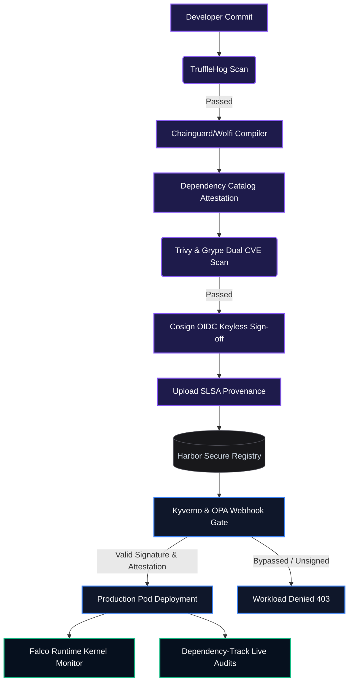
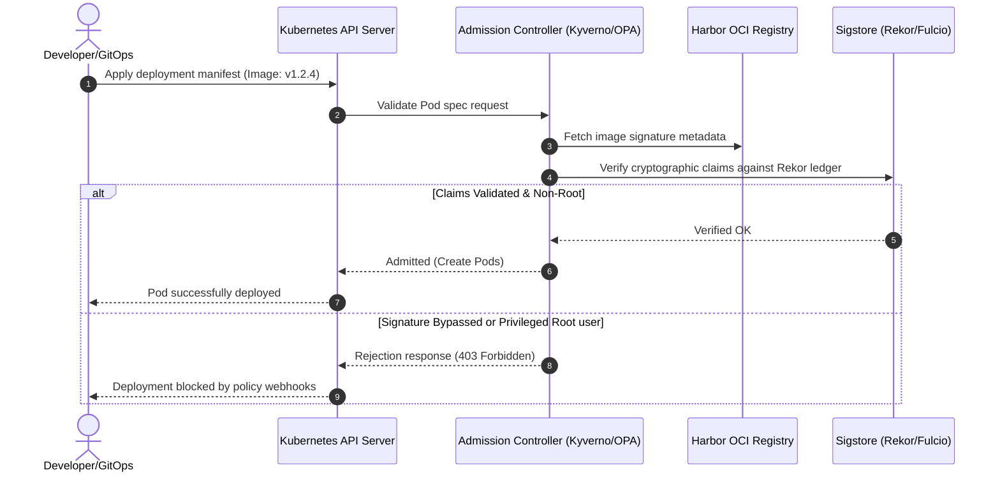

# 🛡️ Obsidian Security: Software Supply Chain Control Cockpit (SLSA Level 4 Compliance)

> **Obsidian Security is a production-grade DevSecOps software supply chain security cockpit. It implements end-to-end provenance validation, container vulnerability intelligence, OIDC keyless signing, policy-driven admission controls, and real-time kernel-level runtime monitoring. Designed with a premium dark cyber theme, it serves as a central control plane to prevent, detect, and remediate supply chain compromises.**

[]()
[]()
[]()
[]()

---

## 🖥️ Live Dashboard Preview


---

## 🏗️ Architecture & DevSecOps Lifecycle Graph

The cockpit monitors the software delivery lifecycle across three major phases: **Build-Time Verification (CI)**, **Admission Control Verification (Deploy)**, and **Kernel Runtime Auditing (Run)**.



---

## 📊 Compliance Infographics (SLSA Level 1-4 Comparison)

| Control Standard | SLSA Level 1 | SLSA Level 2 | SLSA Level 3 | SLSA Level 4 | **Obsidian Security Enforcement** |
| :--- | :---: | :---: | :---: | :---: | :--- |
| **Scripted Builds** | ✔ | ✔ | ✔ | ✔ | **Stateless Wolfi/Chainguard build layers** |
| **Build Service** | ❌ | ✔ | ✔ | ✔ | **Hosted GitHub Actions Runner Environment** |
| **Signed Provenance** | ❌ | ✔ | ✔ | ✔ | **Cosign signing via short-lived OIDC claims** |
| **Security Scanning** | ❌ | ❌ | ✔ | ✔ | **Dual-pipeline Trivy & Grype vulnerability blocks** |
| **Secret Detection** | ❌ | ❌ | ❌ | ✔ | **Pre-compilation git delta scanner (TruffleHog)** |
| **Admission Gateways** | ❌ | ❌ | ❌ | ✔ | **Kyverno verifies Fulcio identity & Rekor ledger** |
| **Runtime Enforcement** | ❌ | ❌ | ❌ | ✔ | **Falco monitors runtime kernel filesystem drifts** |

---

## 🛠️ Security-as-Code Technical Stack

*   **Secrets Analysis:** [TruffleHog](https://github.com/trufflesecurity/trufflehog) scans SCM commit logs for high-entropy tokens.
*   **Vulnerability Intelligence:** Dual scanning utilizing [Trivy](https://aquasecurity.github.io/trivy/) & [Grype](https://github.com/anchore/grype) checks dependencies against the National Vulnerability Database (NVD).
*   **Base Layer security:** Wolfi / Chainguard distroless base image reduces baseline CVE footprint.
*   **Cryptographic Signatures:** [Cosign (Sigstore)](https://docs.sigstore.dev/cosign/overview/) executes OIDC keyless signing, logging proofs to the [Rekor Log](https://github.com/sigstore/rekor) public transparency ledger.
*   **Admission Controls:** [Kyverno](https://kyverno.io/) and OPA Gatekeeper validate provenance and signatures at deployment time.
*   **Threat Audit & Runtime Security:** [Falco](https://falco.org/) monitors active container namespaces for system-call anomalies, while [Dependency-Track](https://dependencytrack.org/) analyzes running packages.

---

## 🎮 Platform Features & Deep-Dive

### 1. Production Security Pipeline & Artifact Registry
Monitor compile-time logs, verify cryptographic signatures, and audit code credentials before build layers compile. Toggle **Simulate Risk Scenarios** (e.g., *Leak Plaintext Secret*, *Introduce Legacy Ubuntu Image*) to watch the compile gates abort the build.
*   **Visual Control Plane:**
    

### 2. Vulnerability Intelligence & Remediation Gateway
Allows real-time inspection of high-risk CVE advisories without exposing raw package list grids. Clicking **Remediate Security Advisories** triggers a simulated Git PR that automatically patches dependency tags, allowing subsequent builds to pass.
*   **Visual Control Plane:**
    

### 3. HashiCorp Vault KMS & Sigstore Ledger
View the cryptographic layout of keys configured inside Vault's transit encryption engine, and inspect public transparency ledger logs (Rekor) validating keyless OIDC identity claims.
*   **Visual Control Plane:**
    

### 4. Cryptographic Provenance Receipts
Inspect the sealed in-toto SLSA build provenance JSON record. This attestation contains compile parameters, git repository source commits, OIDC builders, and materials hashes required to verify the chain of trust.
*   **Visual Control Plane:**
    

### 5. Production Admission Gateway (Kyverno & OPA)
A sandbox to apply deployment manifests. Workloads are intercepted by Kyverno webhooks (validating Cosign OIDC certificates) and OPA Gatekeeper policies (blocking root users and unapproved registries).
*   **Visual Control Plane:**
    



### 6. Continuous Runtime Security & Audit Feed
Monitors system drift logs. Clicking **Simulate Runtime Audit Event** triggers an intrusion scenario (e.g. bash file-write below `/etc/cron.d/malicious`), prompting Falco's system call tracer to instantly flag the container's privilege escalation in real-time.
*   **Visual Control Plane:**
    

### 7. Security-as-Code & GitOps Blueprints
Browse the source configurations powering the security lifecycle, including OPA Rego rules, Kyverno policy YAML declarations, secure pipeline workflows, and Vault Transit configuration policies.
*   **Visual Control Plane:**
    

---

## 🚀 Quick Start & Deployment

### 📋 Prerequisites
- Linux / macOS environment
- Docker Engine & Daemon running
- Docker Compose installed and available in `$PATH`

### ⚙️ Bootstrap Platform
1.  Clone this repository:
    ```bash
    git clone <repository-url> && cd 13-software-supply-chain-security
    ```
2.  Start the control-plane container stack:
    ```bash
    ./start.sh
    ```
3.  Launch the secure interfaces:
    - **Obsidian Control Cockpit:** http://localhost:3000
    - **Backend FastAPI Docs:** http://localhost:8000/docs
    - **Backend Health Check:** http://localhost:8000/health

### 🛑 Tear Down Platform
```bash
./stop.sh
```
